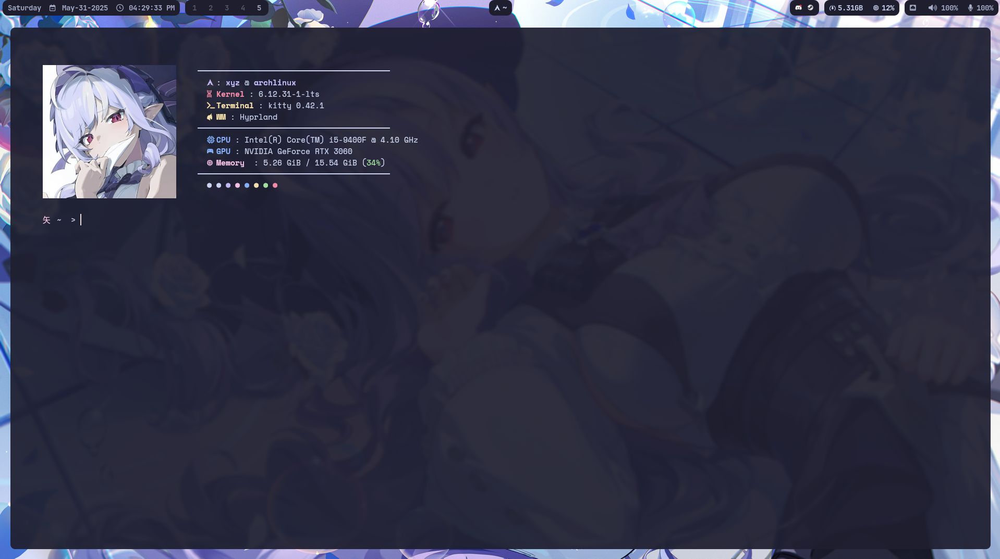
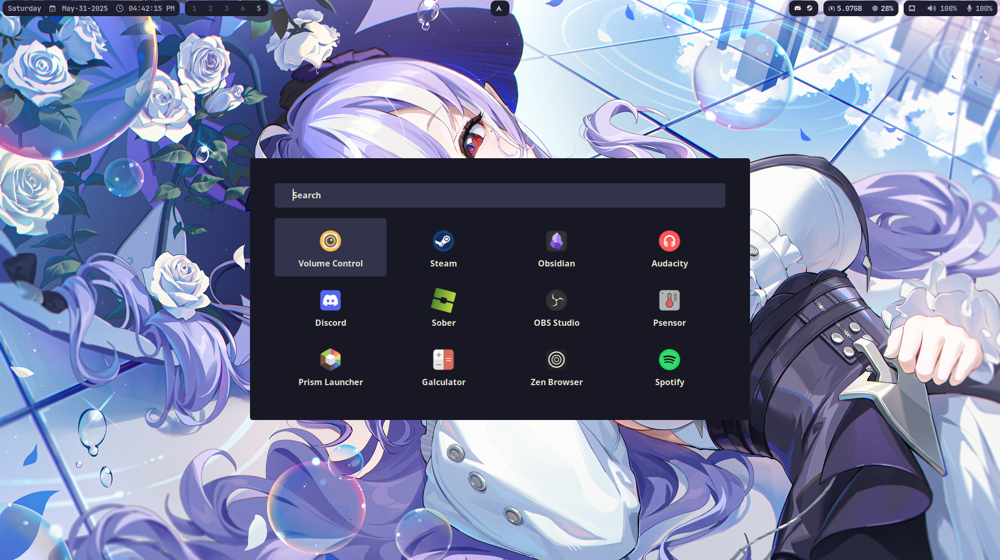
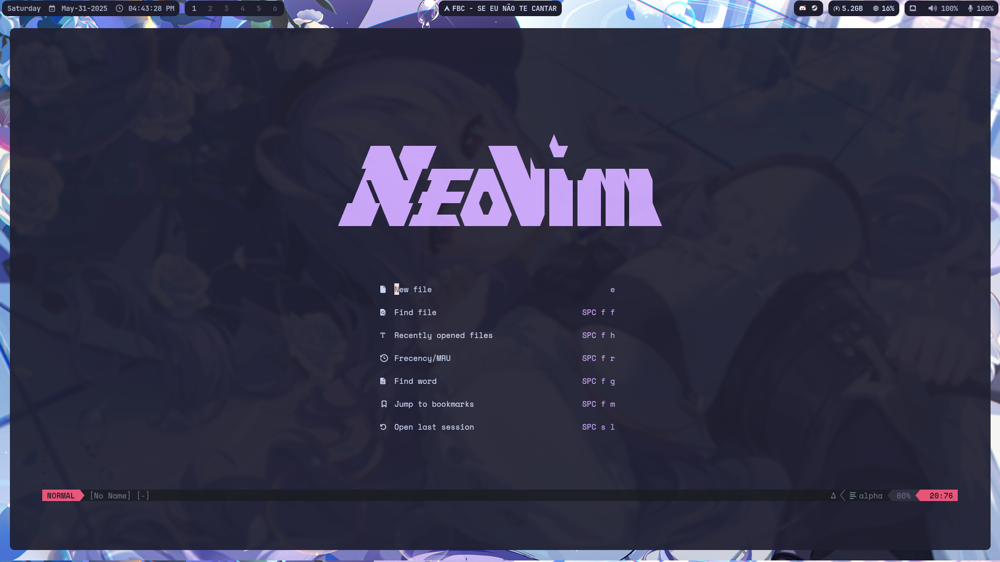

# xyz dotfiles

Personal configurations for Arch Linux with Hyprland. Includes setups for terminal, editor, waybar, notifications, and more.

## >_ Terminal


## Desktop


## Rofi


## Nvim


#### Note: Most of these configurations (like waybar) were inspired by or adapted from the [unixporn](https://www.reddit.com/r/unixporn/) community on Reddit.

## 📦 Dependencies

Before installing, ensure you have the following packages:

### 🖥️ Desktop Environment (Wayland)
- [Hyprland](https://github.com/hyprwm/Hyprland)
- [Waybar](https://github.com/Alexays/Waybar)
- `wl-clipboard`, `waypaper`, `grim`, `slurp`, `hyprpaper`

### 🧰 Utilities
- `kitty` (terminal)
- `wezterm` (alternative terminal)
- `fish` (shell)
- `neovim` (editor)
- `rofi-wayland` (launcher)
- `dunst` (notifications)
- `fastfetch` (system info)
- `pavucontrol` (audio control)
- `btop` (system monitor)
- `wallust` (color scheme generator)

### 🎨 Appearance
- [JetBrains Mono Nerd Font](https://www.nerdfonts.com/font-downloads)
- `papirus-icon-theme`
- `qt5ct`, `qt6ct` (optional, for Qt themes)

## 🚀 Installation

1.  Clone the repository (use --recursive to get the Nvim submodule):
    ```bash
    git clone --recursive https://github.com/themistrinel/dotfiles-hypr.git ~/.dotfiles
    cd ~/.dotfiles
    ```

2.  Run the installation script:
    ```bash
    chmod +x install.sh
    ./install.sh
    ```
    *The script will install dependencies, initialize submodules (like Nvim), and create symbolic links for the configuration folders in `~/.config`.*

## ⌨️ Keybindings

### 🪟 Window Management
| Keybinding              | Action                            |
| ----------------------- | --------------------------------- |
| `Super + Q`             | Close active window               |
| `Super + W`             | Toggle floating                   |
| `Super + J`             | Toggle split (dwindle)            |
| `Super + Shift + Arrows` | Move window                       |
| `Super + M`             | Exit Hyprland                     |

### 🚀 Applications
| Keybinding              | Action                            |
| ----------------------- | --------------------------------- |
| `Super + Return/Enter`  | Open Terminal (Kitty)             |
| `Super + T`             | Open Terminal (Kitty)             |
| `Super + E`             | Open File Manager (Thunar)        |
| `Super + Space`         | Open Launcher (Rofi)              |
| `Super + B`             | Open Browser (Zen)                |
| `Super + C`             | Open Code Editor (VS Code)        |

### ⚙️ System & Tools
| Keybinding              | Action                            |
| ----------------------- | --------------------------------- |
| `Super + Ctrl + W`      | Wallpaper Selector (Waypaper)     |
| `Super + Shift + R`     | **Reload Configurations**          |
| `Super + Esc`           | Restart Waybar                    |
| `Super + Shift + S`     | Screenshot                        |

### 🖥️ Workspaces
| Keybinding              | Action                            |
| ----------------------- | --------------------------------- |
| `Super + 1-0`           | Switch workspace                  |
| `Super + Shift + 1-0`   | Move window to workspace           |
| `Super + Mouse Scroll`  | Navigate workspaces               |
| `Super + S`             | Toggle Special Workspace          |
| `Super + Shift + S`     | Move to Special Workspace         |
