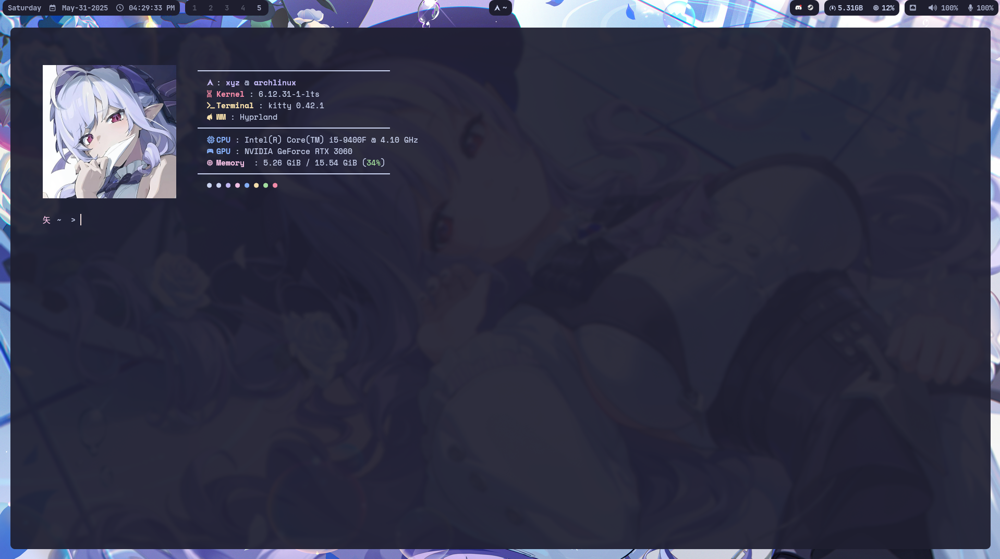
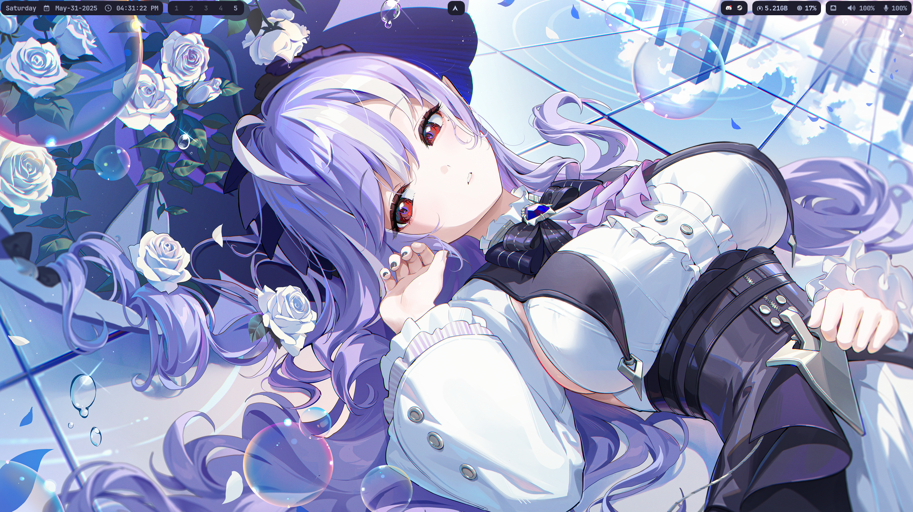
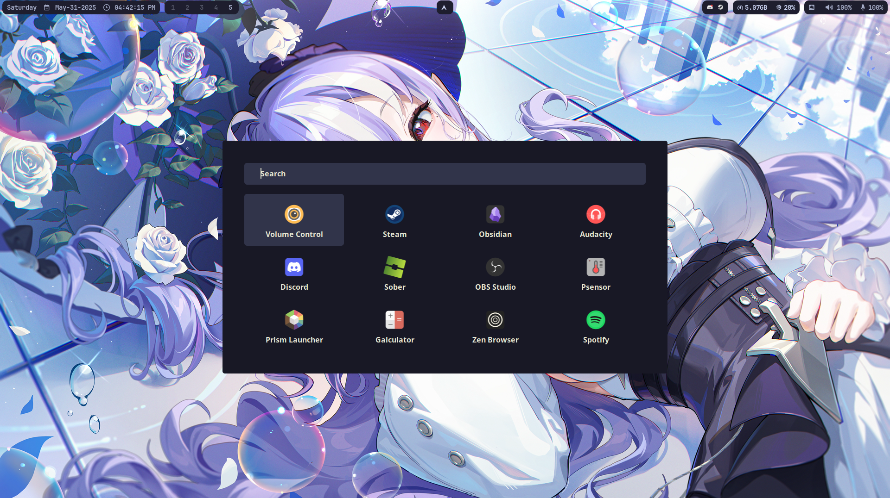
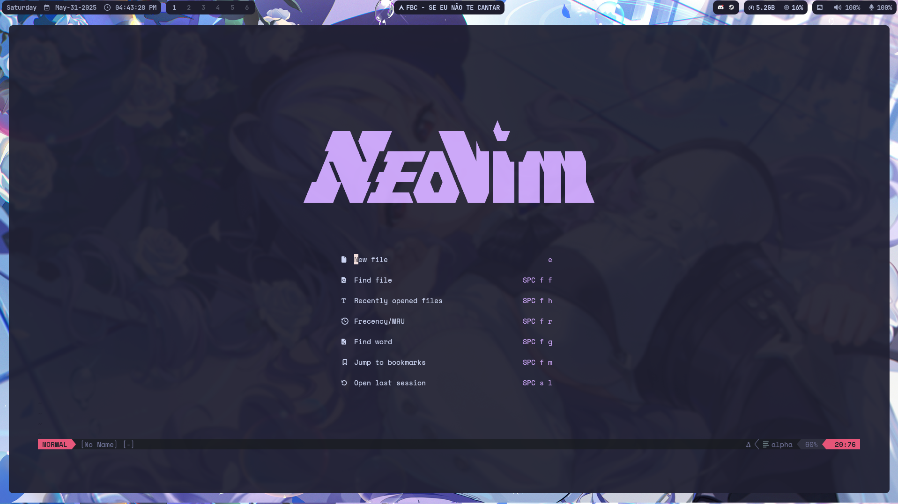

# xyz dotfiles

Personal configurations for Arch Linux with Hyprland. Includes setups for terminal, editor, waybar, notifications, and more.

## >_ Terminal


## Desktop


## Rofi


## Nvim


#### Note: Most of these configurations (like waybar) were inspired by or adapted from the [unixporn](https://www.reddit.com/r/unixporn/) community on Reddit.

## 📦 Dependencies

Before installing, ensure you have the following packages:

### 🖥️ Desktop Environment (Wayland)
- [Hyprland](https://github.com/hyprwm/Hyprland)
- [Waybar](https://github.com/Alexays/Waybar)
- `wl-clipboard`, `waypaper`, `grim`, `slurp`, `hyprpaper`

### 🧰 Utilities
- `kitty` (terminal)
- `wezterm` (alternative terminal)
- `fish` (shell)
- `neovim` (editor)
- `rofi-wayland` (launcher)
- `cliphist` (clipboard manager)
- `dunst` (notifications)
- `fastfetch` (system info)
- `pavucontrol` (audio control)
- `btop` (system monitor)
- `python-pywal` (color scheme generator)
- `ffmpeg` (for video frame extraction)
- `mpvpaper` (for video wallpapers)

### 🎨 Appearance
- [JetBrains Mono Nerd Font](https://www.nerdfonts.com/font-downloads)
- `papirus-icon-theme`, `kora-icon-theme`
- `qt5ct`, `qt6ct` (optional, for Qt themes)
- `nwg-look` (GTK theme switcher)

### 🎨 GTK Themes
- `arc-gtk-theme`, `materia-gtk-theme`, `breeze-gtk` (repositórios oficiais)
- `catppuccin-gtk-theme-mocha`, `orchis-theme-git`, `graphite-gtk-theme-git`
- `colloid-gtk-theme-git`, `sweet-gtk-theme-dark`, `nordic-theme`, `dracula-gtk-theme` (AUR)

## 🚀 Installation

1.  Clone the repository (use --recursive to get the Nvim submodule):
    ```bash
    git clone --recursive https://github.com/themistrinel/dotfiles-hypr.git ~/.dotfiles
    cd ~/.dotfiles
    ```

2.  Run the installation script:
    ```bash
    chmod +x install.sh
    ./install.sh
    ```
    *The script will install dependencies, initialize submodules (like Nvim), and create symbolic links for the configuration folders in `~/.config`.*

## 🎨 Rofi Configuration

This setup includes the beautiful [adi1090x/rofi](https://github.com/adi1090x/rofi) themes collection with:

- **Launchers**: 7 different types with multiple styles each
- **Applets**: Volume, brightness, network, screenshot, MPD, battery, and more
- **Powermenus**: Multiple power menu styles
- **Clipboard Manager**: Full clipboard history with Wayland support

The Rofi themes are automatically installed by the main install script. For manual installation or customization, see [rofi/README.md](rofi/README.md).

### Quick Customization

Change launcher style:
```bash
# Edit ~/.config/rofi/launchers/type-1/launcher.sh
theme='style-1'  # Change to style-2, style-3, etc.
```

Change color scheme:
```bash
# Edit ~/.config/rofi/launchers/type-1/shared/colors.rasi
@import "~/.config/rofi/colors/onedark.rasi"
# Available: adapta, arc, catppuccin, dracula, gruvbox, nord, etc.
```

## 🎨 Pywal - Dynamic Color Schemes

This setup uses [pywal](https://github.com/dylanaraps/pywal) to automatically generate color schemes from your wallpaper.

### How it works

When you change your wallpaper (using waypaper or manually), pywal:
1. Extracts dominant colors from the image
2. Generates color schemes for all configured applications
3. Automatically reloads Hyprland, Kitty, Rofi, and Waybar

### Supported applications

- **Hyprland** - Window borders and UI elements
- **Kitty** - Terminal colors
- **Rofi** - Launcher and applet colors
- **GTK** - Thunar and other GTK apps

### Manual usage

Generate colors from an image:
```bash
wal -i /path/to/image.png -n -t -e
```

Generate colors from a random image in a directory:
```bash
wal -i ~/Pictures -n -t -e
```

### Video wallpapers

For video wallpapers (via mpvpaper), pywal automatically extracts the first frame and generates colors from it.

### Testing

Run the test script to verify your pywal setup:
```bash
./test-pywal.sh
```

For more details, see the pywal section above.

## 🎨 GTK Themes

Este setup inclui múltiplos temas GTK para personalizar a aparência de aplicativos GTK (Thunar, nwg-look, etc).

### Temas Instalados

**Repositórios Oficiais:**
- Arc GTK Theme
- Materia GTK Theme  
- Breeze GTK

**AUR:**
- Catppuccin Mocha
- Orchis (Material Design)
- Graphite (Minimalista)
- Colloid (Colorido)
- Sweet Dark
- Nordic
- Dracula

### Aplicar Temas

**Interface Gráfica:**
```bash
nwg-look
```

**Linha de Comando:**
```bash
gsettings set org.gnome.desktop.interface gtk-theme "Catppuccin-Mocha-Standard-Blue-Dark"
gsettings set org.gnome.desktop.interface icon-theme "Papirus-Dark"
```

### Instalar Apenas Temas GTK

Se você já tem o sistema configurado e quer apenas adicionar mais temas:
```bash
./install-gtk-themes.sh
```

## ⌨️ Keybindings

### 🪟 Window Management
| Keybinding              | Action                            |
| ----------------------- | --------------------------------- |
| `Super + Q`             | Close active window               |
| `Super + W`             | Toggle floating                   |
| `Super + J`             | Toggle split (dwindle)            |
| `Super + Shift + Arrows` | Move window                       |
| `Super + M`             | Exit Hyprland                     |

### 🚀 Applications
| Keybinding              | Action                            |
| ----------------------- | --------------------------------- |
| `Super + Return/Enter`  | Open Terminal (Kitty)             |
| `Super + E`             | Open File Manager (Thunar)        |
| `Super + Space`         | Open Launcher (Rofi Type 1)       |
| `Super + D`             | Open Launcher (Rofi Type 2)       |
| `Super + Tab`           | Window Switcher (Rofi)            |
| `Super + V`             | Clipboard Manager (Rofi)          |
| `Super + P`             | Power Menu (Rofi)                 |
| `Super + B`             | Open Browser (Zen)                |
| `Super + C`             | Open Code Editor (VS Code)        |

### 🎨 Rofi Applets
| Keybinding              | Action                            |
| ----------------------- | --------------------------------- |
| `Super + Shift + V`     | Volume Control                    |
| `Super + Shift + B`     | Brightness Control                |
| `Super + Shift + N`     | Network Manager                   |
| `Super + Shift + P`     | Screenshot Tool                   |

### ⚙️ System & Tools
| Keybinding              | Action                            |
| ----------------------- | --------------------------------- |
| `Super + T`             | Rofi Color Scheme Selector        |
| `Super + Shift + T`     | Rofi Launcher Type Selector       |
| `Super + Ctrl + W`      | Wallpaper Selector (Waypaper)     |
| `Super + Shift + R`     | **Reload Configurations**          |
| `Super + Esc`           | Restart Waybar                    |
| `Super + Shift + S`     | Screenshot                        |

### 🖥️ Workspaces
| Keybinding              | Action                            |
| ----------------------- | --------------------------------- |
| `Super + 1-0`           | Switch workspace                  |
| `Super + Shift + 1-0`   | Move window to workspace           |
| `Super + Mouse Scroll`  | Navigate workspaces               |
| `Super + S`             | Toggle Special Workspace          |
| `Super + Shift + S`     | Move to Special Workspace         |

## 🧩 Zellij (Terminal Multiplexer)

Zellij abre automaticamente com o foot terminal. Tema catppuccin mocha, layout compacto sem barra inferior.

### Navegação direta
| Keybinding     | Action                        |
| -------------- | ----------------------------- |
| `Alt + h/l`    | Mover foco entre panes/tabs   |
| `Alt + j/k`    | Mover foco para baixo/cima    |
| `Alt + n`      | Nova pane                     |
| `Alt + f`      | Toggle panes flutuantes       |
| `Alt + =`      | Aumentar pane                 |
| `Alt + -`      | Diminuir pane                 |
| `Alt + [`      | Layout anterior               |
| `Alt + ]`      | Próximo layout                |
| `Ctrl + q`     | Sair do zellij                |
| `Ctrl + g`     | Modo locked (bloqueia inputs) |

### Modo Pane `Ctrl+p`
| Keybinding | Action                  |
| ---------- | ----------------------- |
| `h/j/k/l`  | Mover foco              |
| `n`        | Nova pane               |
| `d`        | Split para baixo        |
| `r`        | Split para direita      |
| `x`        | Fechar pane             |
| `f`        | Fullscreen              |
| `w`        | Toggle panes flutuantes |
| `z`        | Toggle bordas           |

### Modo Tab `Ctrl+t`
| Keybinding | Action           |
| ---------- | ---------------- |
| `h/l`      | Tab anterior/próxima |
| `n`        | Nova tab         |
| `x`        | Fechar tab       |
| `r`        | Renomear tab     |
| `1-5`      | Ir para tab N    |

### Modo Resize `Ctrl+n`
| Keybinding | Action              |
| ---------- | ------------------- |
| `h/j/k/l`  | Redimensionar pane  |
| `+/-`      | Aumentar/diminuir   |

### Modo Scroll `Ctrl+s`
| Keybinding | Action              |
| ---------- | ------------------- |
| `j/k`      | Scroll linha        |
| `d/u`      | Scroll meia página  |
| `s`        | Buscar no scrollback|
| `Ctrl+c`   | Voltar ao normal    |
